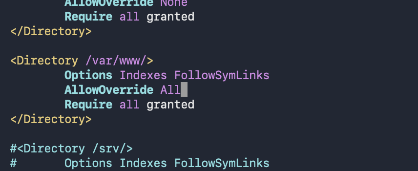

step 1: create EC2 instance with sg allow http, https, ssh

step 2: connect instance

    sudo apt update && sudo apt upgrade -y
    sudo apt install apache2 -y
    sudo systemctl enable apache2
    sudo systemctl start apache2

step 3: copy the public IP of your EC2 instance and paste it in your browser

    http://ip

step 4: install php

    sudo apt install php libapache2-mod-php -y
    sudo apt install php-mysql -y
    php -m | grep mysqli #check
    sudo apt install mysql-client -y
   
check 

   mysql -h wp-data.ct4wkse4iz17.ap-south-1.rds.amazonaws.com -u admin -p

step 6: download latest WordPress files from their official website
    
    wget https://wordpress.org/latest.tar.gz

step 7: Create RDS instance for wordpress
go to ec2 console
create database ->
standard create (full configuration) ->
Mysql ->
give indentity name ->
give user name (admin) ->
self managed ->
vpc (default) ->
give database_name -> create

step 7: Connect RDS and EC2 instance 

    goto connectivity and security ->
    setup EC2 connection -> connect with your EC2 

step 8: verify the connection to database

    mysql -h <RDS-endpoint> -u admin -p <enter password>
    mysql -h wp-data.ct4wkse4iz17.ap-south-1.rds.amazonaws.com -u admin -p 

check database 

     show databases; 

     CREATE DATABASE wpdb;

step 9:  WordPress Installation 

goto where <wget https://wordpress.org/latest.tar.gz> fetched

    pwd 
    ls
    tar -xzf latest.tar.gz
    sudo cp -r wordpress/* /var/www/html/
    sudo usermod -a -G apache2 ubuntu
    sudo chown -R ubuntu:apache2 /var/www

    sudo chown -R www-data:www-data /var/www/html
    sudo chown -R ubuntu:www-data /var/www/html
    sudo chmod -R 775 /var/www/html
    sudo systemctl restart apache2
    sudo chmod 2775 /var/www
    find /var/www -type d -exec sudo chmod 2775 {} \;
    find /var/www -type f -exec sudo chmod 664 {} \;

    cd /var/www/html
    ls
    cp wp-config-sample.php wp-config.php
    nano wp-config.php 

    sudo vim /etc/apache2/apache2.conf

debug: `ls /var/www/html/` if index.html page lists
 
    sudo rm /var/www/html/index.html
    

    sudo systemctl restart apache2

